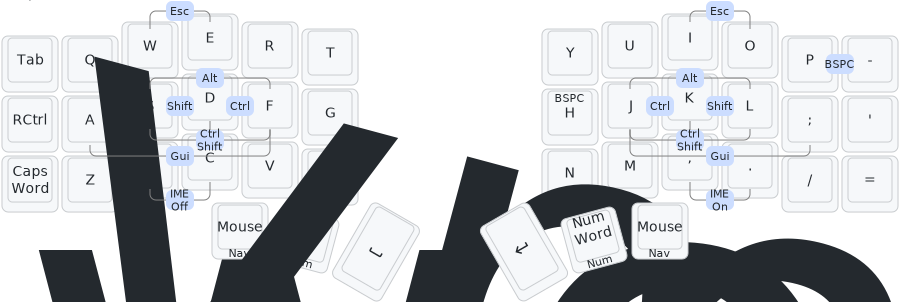

<p align="center">
  
</p>
<h1 align="center">
  qmk-keymaps
</h1>
<p align="center">
  <small><i>:key::world_map:</i></small>
</p>

## :croissant: Corne Keyboard (CRKBD)

### Features

* (One-shot) Home-row combo mods[^hrcm] in `Base`
* Callum-style mods[^callum-style-mods] in `Nav`
* Caps Word[^capsword] and Num Word[^numword]
* One-shot sym
* Media control key like EarPods
* `Esc` cooperate with Japanese IME in Vim Insert mode

See also [`keymap.c`](./src/keyboards/crkbd/rev1/keymaps/efumaxay/keymap.c) and [`users/efumaxay/*`](./src/users/efumaxay).


### Build

```sh
task build:crkbd
```

[^hrcm]: https://jasoncarloscox.com/blog/combo-mods/
[^capsword]: https://docs.qmk.fm/#/feature_caps_word
[^numword]: https://github.com/qmk/qmk_firmware/tree/906108fb486797ab2f3eb7c3a6f70e099c1199e6/users/replicaJunction#capsword-and-numword
[^callum-style-mods]: https://github.com/callum-oakley/qmk_firmware/tree/master/users/callum#oneshot-modifiers
